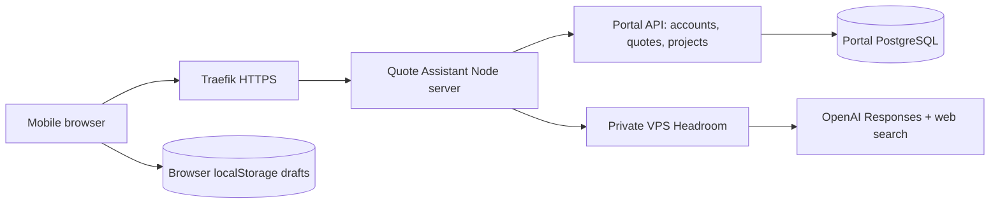

# Revive Quote Assistant architecture

## Source of truth and related system

This private repository, `SteelCity-ai/revive-quote-assistant`, owns the standalone mobile web app and its Node server. The intended public origin is `https://quote.reviverepairco.com`. The working checkout is `C:\Users\mike\.codex\workspaces\revive-quote-assistant-repo`.

The companion repository is [SteelCity-ai/revive-project-portal-VPS](https://github.com/SteelCity-ai/revive-project-portal-VPS). It owns portal accounts, customers, projects, immutable quotes, PDF records, customer acceptance and SOW Intake. Its public API is `https://portal.reviverepairco.com/api/v1`. The `reviverepairco` repository is the website, not this integration's backend.

The earlier `G:\My Drive\Revive\QuoteAssistant` folder and C: preview runtime are historical copies. Make new edits here and push them to this repository. Never copy their private environment files into Git.

## Request and data flow

The React 19/Vite frontend renders the guide, cost editor, comparison/material report, and approval UI. The production Node 22 server serves the compiled `dist/` files and the same-origin `/api/` routes. Vite is development tooling; it is not exposed in production.

### Main modules

| Path | Responsibility |
| --- | --- |
| `src/AppGate.tsx` | Production sign-in gate; local development remains available without portal login. |
| `src/AIApp.tsx` | Quote lifecycle, generation cancellation, protection against applying stale AI results. |
| `src/domain.ts` | Three intake tracks, conditional questions, validation and deterministic money/area arithmetic. |
| `src/Guide.tsx` | One question at a time; explicit unknown answers. |
| `src/Estimate.tsx`, `src/AIReport.tsx` | Editable cost lines, material list and cited market comparisons. |
| `src/Review.tsx`, `src/PortalApproval.tsx` | Review, approval identity, customer selection, confirmed portal receipt. |
| `src/portal.ts` | Shared client request helpers and revision fingerprints. |
| `src/storage.ts` | Browser-local drafts and JSON export. |
| `server/app.mjs` | HTTP routing, production auth on paid requests, exact-origin checks, limits, static files and health. |
| `server/portal.mjs` | Restricted portal bridge; opaque browser sessions with upstream cookie kept only in server memory. |
| `server/estimate.mjs` | OpenAI research/structured estimation, source extraction, schema and material reconciliation. |
| `deploy/compose.yml`, `Dockerfile` | Reproducible single-instance VPS deployment with resource limits. |

## Estimate to project contract

1. The administrator signs in using their existing portal email/password and selects a matching portal customer.
2. `POST /api/portal/quotes` forwards `{ clientId, approvalId, quote }` to portal `POST /quotes`. `approvalId` is a stable UUID retained across retries; quote content contains `id`, `type`, `kind`, answers, priced lines, pricing settings, assumptions, exclusions, terms, acknowledgment and optional AI evidence.
3. The portal stores an immutable revision and estimate PDF and creates one `PLANNED` project atomically. Receipt fields include `id`, `revision`, `approvedAt`, `status`, `projectId`. Revisions share the pending project. UI success requires this receipt.
4. Portal **Accept & activate project** records the customer's acceptance evidence for the latest revision. It activates the same project and creates SOW draft text/PDF in one transaction.
5. The existing project SOW Intake loads the accepted scope. Work-plan generation, review and import remain explicit actions.

The portal owns `sales_quote_thread` and `sales_quote_revision`, introduced by `0006_sales_quotes.sql`. Do not create parallel quote tables in this app or apply the obsolete Google Drive `0004_sales_quotes.sql` draft. `/quotes/capabilities` must return `version: 1`, `approvalCreatesPendingProject`, `acceptanceActivatesProject`, and `sowHandoff`.

Bridge allowlist: `status`, `login`, `logout`, `clients`, `POST quotes`, and `GET quotes/:uuid`. Portal PDF and acceptance links use the portal's own authenticated interface. Quote Assistant is not a generic proxy and never accepts an arbitrary upstream URL from the browser.

## Security and persistence boundaries

- Production requires an exact HTTPS `APP_ORIGIN`. Every write checks Origin and JSON content type. AI generation also revalidates the current portal ADMIN role before any billed call.
- Login passwords are forwarded only to the configured HTTPS portal and never persisted or logged. Upstream session cookies stay in a bounded in-memory map; the browser gets a separate opaque `Secure; HttpOnly; SameSite=Strict; Path=/api` cookie. Eight-hour expiry, logout and process restart invalidate the local session. Use one replica until a shared session store is implemented.
- A maximum of 12 generations per authenticated account per hour and one active generation globally bounds spend/concurrency. Login attempts are limited by socket address; behind the local proxy this is a conservative shared limit (10 per ten minutes). Do not trust arbitrary forwarded headers to relax it.
- Built frontend assets contain no API keys. Runtime secrets reside only in `/docker/revive-quote-assistant/shared/.env`, owned by root with mode 600. `.env*` is excluded from Git and Docker context.
- Drafts remain on the device; signing in does not synchronize them across devices. All administrators on a shared browser profile can access that profile's drafts. Use separate device/browser profiles where needed. Confirmed approved revisions and PDFs persist in the portal database.
- Static serving is restricted to the built directory and known asset types. Production responses include CSP, HSTS, frame protection and no-store for API data. Provider errors are sanitized.
- Nothing sends email/SMS, contacts suppliers, purchases materials or records customer acceptance automatically.

## Pricing rules and AI evidence

Material/subcontract cost = quantity × unit cost. Labor = total hours × hourly rate (hours are not multiplied again by quantity). Contingency applies to direct cost, markup to direct cost plus contingency, and tax to material/subcontract amounts. Intermediates round to cents. Reconfirm tax treatment per job. Editing invalidates approval.

AI research prioritizes local sources, then online sources. Two web-search research calls feed one structured estimate request. Listed prices, published ranges and estimated allowances stay distinct. Material rows reference estimate lines and never add costs twice. Only documented whole-project comparisons establish the displayed market range; generic cost guides remain context. Unknown measurements and unsupported prices remain flagged. No completeness or pricing-accuracy guarantee is implied by successful generation.

Requests route through VPS Headroom at `http://100.82.54.127:8877/v1`; the private dashboard is `/dashboard`. Research defaults to `gpt-4.1`, estimation to `gpt-5.4-mini-2026-03-17`. Keep model changes in server configuration and re-run evaluation before changing prompts/models.

## Voice and roof measurement: not implemented

Required future voice behavior: the user taps **Talk to Revive**, grants microphone access, and speaks the job type/address. Revive greets the logged-in user, asks the next missing question aloud, waits for an answer, detects the end of the user's turn, validates/extracts the answer, confirms ambiguous addresses/numbers, and proceeds. Support interruption, repeat, correction, back, pause/resume and typed fallback. Read back scope and total before a distinct confirmed approval action. Silence/background speech must not approve or send anything. Customer acceptance remains distinct from staff quote approval.

Use a real voice-session transport and server-authorized short-lived credentials; never expose the private OpenAI key. Evaluate Realtime/WebRTC with semantic turn detection and strict server tool schemas. Confirm Headroom compatibility for that transport before changing routing. Test actual Android/iPhone microphones, Bluetooth, network loss and interruptions; a browser mock is not proof of hands-free operation. Mobile browsers may suspend audio when locked/backgrounded; do not promise a background wake word or driving safety. The current app exposes `voiceAvailable: false`.

Google roof measurement is also pending. Keep manual area/pitch inputs working. A future Solar API measurement proposal must disclose imagery/coverage limitations and be confirmed before use. Avoid applying pitch twice; keep waste separate.

## Verification and deployment

Run `npm ci`, `npm test`, `npm run build`, `npm audit --omit=dev --audit-level=high` and `docker build`. Tests cover pricing invariants, sources/material mapping, approval retry identity, bridge sessions/origins and production auth/spend limits. CI runs these commands without provider credentials. Paid/live-provider verification is separate.

See [DEPLOYMENT.md](docs/DEPLOYMENT.md) for staging, secrets, DNS/TLS, health and rollback. See [HANDOFF.md](docs/HANDOFF.md) for current delivery evidence and outstanding work. The portal has newer live changes that are not fully represented in its last published main; never replace its production tree from an old clone without reconciling those changes.
